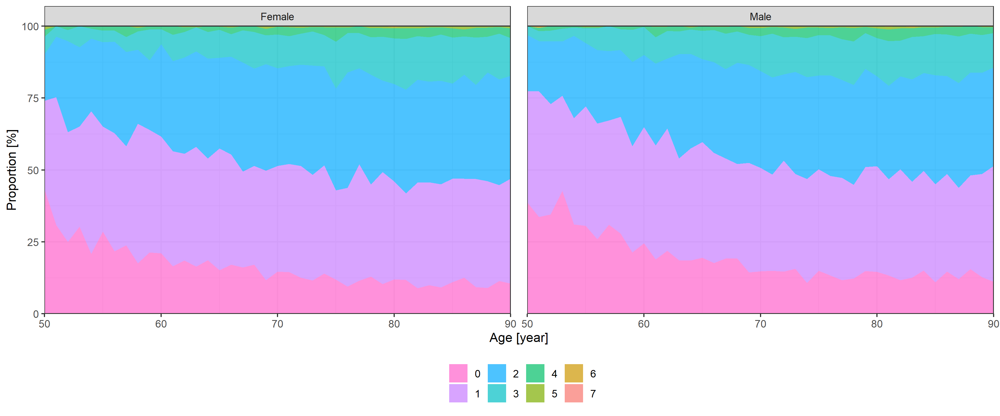

Different approaches to quantify years of life lost from COVID-19
================
Tamás Ferenci

## Manuscript

Citation: Tamás Ferenci. Different approaches to quantify years of life
lost from COVID-19. Eur J Epidemiol. 2021 Jun 10;1-9. DOI:
10.1007/s10654-021-00774-0. PMID: 34114188.

Published paper is available at
<https://link.springer.com/article/10.1007/s10654-021-00774-0>.

## Analysis

We first do some preparation:

``` r
library(ggplot2)
theme_set(theme_bw())
library(data.table)

name_cols <- c("atr_fib", "cancer", "copd", "demen", "diab", "h_fail", "hypert", "ihd", "renal", "liver",
               "stroke")
name_cols_age <- c("atr_fib:age", "cancer:age", "copd:age", "demen:age", "diab:age", "h_fail:age", 
                   "hypert:age", "ihd:age", "renal:age", "liver:age", "stroke:age")

Pop50plus <- 3828819
```

We download the life table:

``` r
if(!file.exists("LifeTableHUN.rds")) {
  LifeTableMale <- HMDHFDplus::readHMDweb("HUN", "mltper_1x1")
  LifeTableFemale <- HMDHFDplus::readHMDweb("HUN", "fltper_1x1")
  LifeTable <- rbind(cbind(Sex = "Male", LifeTableMale), cbind(Sex = "Female", LifeTableFemale))
  LifeTable <- data.table(LifeTable[LifeTable$Year==2017, ])
  saveRDS(LifeTable, "LifeTableHUN.rds")
} else LifeTable <- readRDS("LifeTableHUN.rds")
```

Next, we download the epidemiologic data:

``` r
if(!file.exists("EpiData.rds")) {
  EpiData <- fread("https://covid.ourworldindata.org/data/owid-covid-data.csv")
  EpiData$date <- EpiData$date-1
} else EpiData <- readRDS("EpiData.rds")
```

We then scrape the mortality data:

``` r
if(!file.exists("MortData.rds")) {
  pg <- xml2::read_html("https://koronavirus.gov.hu/elhunytak")
  lastpg <- strsplit(rvest::html_attr(rvest::html_node(pg, xpath = "//li[@class='pager-last']/a"),
                                      "href"), "=")[[1]][2]
  MortData <- rbindlist(lapply(0:lastpg, function(i)
    rvest::html_table(xml2::read_html(paste0("https://koronavirus.gov.hu/elhunytak?page=", i)))[[1]]))
  names(MortData) <- c("ID", "Sex", "Age", "Comorbidities")
  unique(MortData$Sex)
  MortData$Sex <- as.factor(ifelse(MortData$Sex%in%c("férfi", "Férfi"), "Male", "Female"))
  NewDeathsHUN <- EpiData[iso_code=="HUN", .(date, new_deaths)][!is.na(new_deaths)]
  DeathDates <- rep(NewDeathsHUN$date, NewDeathsHUN$new_deaths)
  MortData <- MortData[order(ID)][1:length(DeathDates)]
  MortData$Date <- DeathDates
  saveRDS(MortData, "MortData.rds")
} else MortData <- readRDS("MortData.rds")

StartDate <- min(MortData$Date)
EndDate <- max(MortData$Date)
```

For reproducibility of the EJE paper, we can use the original data
(`MortData <- readRDS("MortData_20210512.rds")`).

Basic data:

``` r
nrow(MortData)
```

    ## [1] 42069

``` r
MortData <- MortData[Age>=50]
table(MortData$Sex)
```

    ## 
    ## Female   Male 
    ##  19981  20142

``` r
nrow(MortData)
```

    ## [1] 40123

We create the first plot and save it:

``` r
ggplot(MortData, aes(x = Age, color = Sex)) + stat_density(geom = "line", position = "identity") +
  labs(x = "Age [year]", y = "") +
  theme(legend.position = "bottom", legend.title = element_blank())
```

<!-- -->

``` r
ggsave("Fig1.eps", width = 84, height = 84, units = "mm", device = cairo_ps)
```

We can now merge the life table and the mortality data:

``` r
MortData <- merge(MortData, LifeTable)
MortData$Sex <- as.factor(MortData$Sex)
```

YLL using the ordinary calculation:

``` r
sum(MortData$ex) # YLL
```

    ## [1] 428823

``` r
tapply(MortData$ex, MortData$Sex, sum)
```

    ## Female   Male 
    ## 209243 219581

``` r
sum(MortData$ex) / nrow(MortData) # YLL per death
```

    ## [1] 10.7

``` r
tapply(MortData$ex, MortData$Sex, mean)
```

    ## Female   Male 
    ##   10.5   10.9

``` r
sum(MortData$ex) / (as.numeric(difftime(EndDate, StartDate, units = "days"))/365.24 * Pop50plus) # YLL per person-year
```

    ## [1] 0.0589

### Original EJE paper

We then extract the comorbidities:

``` r
sort(unique(do.call(c, sapply(MortData$Comorbidities, strsplit, split = ""))))
```

    ## Warning in do.call(c, sapply(MortData$Comorbidities, strsplit, split = "")):
    ## unable to translate 'demencia, Parkinson<U+0096>kór, magasvérnyomás-betegség,
    ## szívelégtelenség' to native encoding

    ## Warning in do.call(c, sapply(MortData$Comorbidities, strsplit, split = "")):
    ## unable to translate 'nyelocso <U+0096> diverticulum, köszvény' to native
    ## encoding

    ##  [1] "-"      " "      " "      "\t"      "\n"     "\r"     "("      ")"     
    ##  [9] ","      "."      "/"      ":"      ";"      "?"      "”"      "„"     
    ## [17] "<U+0096>" "0"      "1"      "2"      "3"      "5"      "9"      "a"     
    ## [25] "A"      "á"      "Á"      "b"      "B"      "c"      "C"      "d"     
    ## [33] "D"      "e"      "E"      "é"      "É"      "f"      "F"      "g"     
    ## [41] "G"      "h"      "H"      "i"      "I"      "í"      "j"      "J"     
    ## [49] "k"      "K"      "l"      "L"      "m"      "M"      "n"      "N"     
    ## [57] "o"      "o"      "O"      "ó"      "ö"      "ő"      "p"      "P"     
    ## [65] "r"      "R"      "s"      "S"      "t"      "T"      "u"      "u"     
    ## [73] "U"      "ú"      "ü"      "Ü"      "ű"      "v"      "V"      "w"     
    ## [81] "W"      "x"      "y"      "Y"      "z"      "Z"

``` r
MortData$Comorbidities[grep("\u0096", MortData$Comorbidities)] <- gsub("\u0096", "", MortData$Comorbidities[grep("\u0096", MortData$Comorbidities)])

MortData$Comorbidities <- stringi::stri_trans_general(MortData$Comorbidities, "Latin-ASCII")

sort(unique(do.call(c, sapply(MortData$Comorbidities, strsplit, split = ""))))
```

    ##  [1] "-"  " "  "\t"  "\n" "\r" "\"" "("  ")"  ","  "."  "/"  ":"  ";"  "?"  "0" 
    ## [16] "1"  "2"  "3"  "5"  "9"  "a"  "A"  "b"  "B"  "c"  "C"  "d"  "D"  "e"  "E" 
    ## [31] "f"  "F"  "g"  "G"  "h"  "H"  "i"  "I"  "j"  "J"  "k"  "K"  "l"  "L"  "m" 
    ## [46] "M"  "n"  "N"  "o"  "O"  "p"  "P"  "r"  "R"  "s"  "S"  "t"  "T"  "u"  "U" 
    ## [61] "v"  "V"  "w"  "W"  "x"  "y"  "Y"  "z"  "Z"

``` r
MortData$atr_fib <- grepl("fibril", MortData$Comorbidities, ignore.case = TRUE)
MortData$cancer <- grepl("rak|tumor|noma|daganat|metas[z]?t|attet", MortData$Comorbidities, ignore.case = TRUE)
MortData$copd <- grepl("obstru[c|k]tiv[[:blank:]]tudo|copd", MortData$Comorbidities, ignore.case = TRUE)
MortData$demen <- grepl("demen", MortData$Comorbidities, ignore.case = TRUE)
MortData$diab <- grepl("diabetes|cukorbeteg|mellitus", MortData$Comorbidities, ignore.case = TRUE)|grepl("DM|IDDM|T1DM|T2DM", MortData$Comorbidities, ignore.case = FALSE)
MortData$h_fail <- grepl("szivelegtelen", MortData$Comorbidities, ignore.case = TRUE)
MortData$hypert <- grepl("h[i|y]pertonia|magas[[:blank:]|-]?vernyomas", MortData$Comorbidities, ignore.case = TRUE)
MortData$ihd <- grepl("isch[a]?emias[[:blank:]]sziv|iszk[a]?emias[[:blank:]]sziv|angina|infar[k|c]tus", MortData$Comorbidities, ignore.case = TRUE)|grepl("IHD|CAD|CHD|AMI", MortData$Comorbidities, ignore.case = FALSE)
MortData$renal <- grepl("kronikus[[:blank:]]vese[[:blank:]|-]?elegtelen|chronicus[[:blank:]]vese[[:blank:]|-]?elegtelen", MortData$Comorbidities, ignore.case = TRUE)
MortData$liver <- grepl("kronikus[[:blank:]]maj|chronicus[[:blank:]]maj|majzsugor|majelegtelen|cirr|kronikus[[:blank:]]hepa|chronicus[[:blank:]]hepa|majmegna|alkoholos[[:blank:]]maj", MortData$Comorbidities, ignore.case = TRUE)
MortData$stroke <- grepl("stroke|sztrok|agyi[[:blank:]]erkat|agyverzes", MortData$Comorbidities, ignore.case = TRUE)

ComorbLabels <- data.table(variable = c("atr_fib", "cancer", "copd", "demen", "diab",
                                        "h_fail", "hypert", "ihd", "renal", "liver", "stroke"),
                           varlabel = c("Atrial fibrillation", "Cancer", "COPD", "Dementia", "Diabetes", "Heart failure",
                                        "Hypertension", "IHD", "Chronic renal failure", "Chronic liver disease", "Stroke"))
```

We calculate the first table and save it:

``` r
tab1 <- merge(melt(MortData,  measure.vars = ComorbLabels$variable), ComorbLabels)[
  ,.(mean(value)*100, binom.test(sum(value), length(value))$conf.int[1]*100,
     binom.test(sum(value), length(value))$conf.int[2]*100), .(varlabel)
][, .(varlabel, paste0(round(V1, 1), " (", round(V2, 1), "-", round(V3, 1), ")"))]
knitr::kable(tab1)
```

| varlabel              | V2               |
|:----------------------|:-----------------|
| Atrial fibrillation   | 3.5 (3.4-3.7)    |
| Cancer                | 11.1 (10.8-11.4) |
| COPD                  | 4.2 (4-4.4)      |
| Dementia              | 6.9 (6.7-7.2)    |
| Diabetes              | 29.5 (29-29.9)   |
| Heart failure         | 7 (6.7-7.2)      |
| Hypertension          | 67.1 (66.6-67.5) |
| IHD                   | 14.2 (13.9-14.6) |
| Chronic liver disease | 0.8 (0.7-0.9)    |
| Chronic renal failure | 5.1 (4.9-5.3)    |
| Stroke                | 2.9 (2.8-3.1)    |

``` r
write.csv2(tab1, "Tab1.csv")
```

We then create the second figure and save it:

``` r
predgrid <- expand.grid(Age = seq(50, 100, 0.1), Sex = c("Male", "Female"))
ComorbPrevs <- rbindlist(setNames(lapply(ComorbLabels$variable, function(v) {
  fit <- mgcv::gam(as.formula(paste0(v, "~ s(Age, by = Sex) + Sex")), data = MortData,
                   family = binomial)
  cbind(predgrid, with(predict(fit, predgrid, se.fit = TRUE),
                       data.frame(est = plogis(fit), lwr = plogis(fit - 1.96*se.fit),
                                  upr = plogis(fit + 1.96*se.fit))))
}), ComorbLabels$varlabel), idcol = TRUE)
ggplot(ComorbPrevs,
       aes(x = Age, y = est*100, color = Sex, fill = Sex, ymin = lwr*100, ymax = upr*100)) +
  geom_line() + geom_ribbon(alpha = 0.2, linetype = 0) + facet_wrap(~.id) +
  labs(x = "Age [year]", y = "Prevalence [%]") +
  theme(legend.position = "bottom", legend.title = element_blank())
```

<!-- -->

``` r
ggsave("Fig2.eps", width = 174, height = 174, units = "mm", device = cairo_ps)
```

And then the third one:

``` r
MortData$ComorbCount <- rowSums(MortData[, ..name_cols])
prop.table(table(MortData$ComorbCount))*100
```

    ## 
    ##        0        1        2        3        4        5        6        7 
    ## 15.04873 36.45540 33.20290 12.30716  2.53221  0.39130  0.05982  0.00249

``` r
mean(MortData$ComorbCount>2)*100
```

    ## [1] 15.3

``` r
ggplot(reshape2::melt(table(MortData$ComorbCount, MortData$Age, MortData$Sex)),
       aes(x = Var2, fill = forcats::fct_rev(as.factor(Var1)), y = value)) +
  geom_area(position = "fill", alpha = 0.7) +
  facet_grid(cols = vars(Var3)) + scale_x_continuous(expand = c(0, 0), limits = c(50, 90)) +
  scale_y_continuous(labels = scales::percent_format(suffix = ""), expand = c(0, 0)) + 
  labs(x = "Age [year]", y = "Proportion [%]", fill = "Number of comorbidities") +
  guides(fill = guide_legend(reverse = TRUE)) +
  theme(legend.position = "bottom", legend.title = element_blank(),
        panel.spacing = unit(1, "lines"))
```

    ## Warning: Removed 224 rows containing missing values (position_stack).

<!-- -->

``` r
ggsave("Fig3.eps", width = 174, height = 174, units = "mm", device = cairo_ps)
```

    ## Warning: Removed 224 rows containing missing values (position_stack).

Next, we integrate the external survival model and run a few checks:

``` r
male_coef <- read.csv("https://raw.githubusercontent.com/dmcalli2/covid19_yll_final/master/Data/sail_outputs/male_coef.csv")
male_coef <- setNames(male_coef$x, male_coef$X)
female_coef <- read.csv("https://raw.githubusercontent.com/dmcalli2/covid19_yll_final/master/Data/sail_outputs/female_coef.csv")
female_coef <- setNames(female_coef$x, female_coef$X)

SurvGomp <- function(t, start, ...) {
  ret <- (1 - flexsurv:::pgompertz_work(t, ...))/(1-flexsurv:::pgompertz_work(start, ...))
  ret[t<start] <- 1
  ret
}

times_vect <- seq(50, 150, 0.1)

temp <- 1-SurvGomp(t = times_vect, start = MortData$Age[2], shape = male_coef["shape"],
                   rate = exp(male_coef["rate"] +
                                as.matrix(MortData[2, ..name_cols])%*%male_coef[name_cols] +
                                (MortData$Age[2]*as.matrix(MortData[2, ..name_cols]))%*%male_coef[name_cols_age]),
                   lower_tail = TRUE, give_log = FALSE)

temp <- 1-SurvGomp(t = times_vect, start = 60, shape = female_coef["shape"],
                   rate = exp(female_coef["rate"]),
                   lower_tail = TRUE, give_log = FALSE)

sum(temp - c(0, temp[-length(temp)]))
```

    ## [1] 1

``` r
sum((temp - c(0, temp[-length(temp)]))*times_vect)
```

    ## [1] 88

``` r
sum((temp - c(0, temp[-length(temp)]))*times_vect)-MortData$Age[2]
```

    ## [1] 38

``` r
offsetgrid <- data.table(expand.grid(Sex = c("Male", "Female"), Age = 50:110))
offsetgrid$AdjustedEx <- sapply(1:nrow(offsetgrid), function(i) {
  usedcoefs <- if(offsetgrid$Sex[i]=="Male") male_coef else female_coef
  temp <- 1-SurvGomp(t = times_vect, start = offsetgrid$Age[i], shape = usedcoefs["shape"],
                     rate = exp(usedcoefs["rate"]), lower_tail = TRUE, give_log = FALSE)
  sum((temp - c(0, temp[-length(temp)]))*times_vect)-offsetgrid$Age[i]
})
offsetgrid <- merge(offsetgrid, LifeTable)
ggplot(offsetgrid, aes(x = ex, y = AdjustedEx)) + geom_point() + facet_grid(cols = vars(Sex)) +
  geom_abline(intercept = 0, slope = 1)
```

<!-- -->

``` r
offsetgrid$ratio <- offsetgrid$ex/offsetgrid$AdjustedEx
offsetgrid$leratio <- (offsetgrid$Age + offsetgrid$ex)/(offsetgrid$Age + offsetgrid$AdjustedEx)

MortData$AdjustedEx <- sapply(1:nrow(MortData), function(i) {
  usedcoefs <- if(MortData$Sex[i]=="Male") male_coef else female_coef
  temp <- 1-SurvGomp(t = times_vect, start = MortData$Age[i], shape = usedcoefs["shape"],
                     rate = exp(usedcoefs["rate"] +
                                  as.matrix(MortData[i, ..name_cols])%*%usedcoefs[name_cols] +
                                  (MortData$Age[i]*as.matrix(MortData[i, ..name_cols]))%*%usedcoefs[name_cols_age]),
                     lower_tail = TRUE, give_log = FALSE)
  # sum((temp - c(0, temp[-length(temp)]))*times_vect)*offsetgrid[Sex==MortData$Sex[i]&Age==MortData$Age[i]]$leratio-MortData$Age[i]
  (sum((temp - c(0, temp[-length(temp)]))*times_vect)-MortData$Age[i])*offsetgrid[Sex==MortData$Sex[i]&Age==MortData$Age[i]]$ratio
})
```

We can now create the fourth figure:

``` r
ggplot(MortData, aes(x = ex, y = AdjustedEx, color = Age)) +
  geom_jitter(size = 0.1, width = 1, height = 1) +
  facet_grid(cols = vars(Sex)) + geom_abline(intercept = 0, slope = 1, color = "red") +
  labs(x = "Expected number of years of life remaining, Hungarian life table [year]",
       y = "Expected number of years of life remaining, Hanlon et al survival model [year]")
```

<!-- -->

``` r
ggsave("Fig4.eps", width = 174, height = 174, units = "mm", device = cairo_ps)
```

And calculate the adjusted YLLs:

``` r
sum(MortData$AdjustedEx) # YLL
```

    ## [1] 375614

``` r
sum(MortData$AdjustedEx) / nrow(MortData) # YLL per death
```

    ## [1] 9.36

``` r
tapply(MortData$AdjustedEx, MortData$Sex, mean)
```

    ## Female   Male 
    ##   9.13   9.59

``` r
sum(MortData$AdjustedEx) / (as.numeric(difftime(EndDate, StartDate, units = "days"))/365.24 * Pop50plus) # YLL per person-year
```

    ## [1] 0.0516

``` r
100-sum(MortData$AdjustedEx)/sum(MortData$ex)*100
```

    ## [1] 12.4

Life-table norms:

``` r
sum(LifeTable[Sex=="Female", .(dx*ex)]$V1)/sum(LifeTable[Sex=="Female"]$dx)
```

    ## [1] 10.3

``` r
sum(LifeTable[Sex=="Male", .(dx*ex)]$V1)/sum(LifeTable[Sex=="Male"]$dx)
```

    ## [1] 11.9

``` r
sum(LifeTable[, .(dx*ex)]$V1)/sum(LifeTable$dx)
```

    ## [1] 11.1

### Reply letter

We first download the GBD Reference Life Table and transform it to the
forms that we will later need:

``` r
GBDRef5 <- fread("IHME_GBD_2019_TMRLT_Y2021M01D05.CSV", check.names = TRUE)
GBDRef5100 <- rbind(GBDRef5, data.table(Age = 100,
                                        Life.Expectancy = GBDRef5[Age==95]$Life.Expectancy))
GBDRef <- data.table(Age = 0:95, ex = approx(GBDRef5$Age, GBDRef5$Life.Expectancy, 0:95)$y)
GBDRef <- rbind(GBDRef, data.table(Age = 96:105, ex = GBDRef[Age==95]$ex))

MortData <- merge(MortData, GBDRef[, .(Age, GBDex = ex)], by = "Age")
```

We can now calculate the aspirational metrics:

``` r
sum(MortData$GBDex)
```

    ## [1] 718170

``` r
sum(MortData$GBDex)/nrow(MortData)
```

    ## [1] 17.9

``` r
sapply(c(70, 75, 80, 85), function(targ) sum(pmax(targ-MortData$Age, 0)))
```

    ## [1]  95118 174580 285677 430825

``` r
sapply(c(70, 75, 80, 85), function(targ) sum(pmax(targ-MortData$Age, 0)))/nrow(MortData)
```

    ## [1]  2.37  4.35  7.12 10.74

Investigating how the result of the fixed target age approach depends on
the target age set:

``` r
yllaspfixed <- data.table(TargetAge = 50:100,
                          YLL = sapply(50:100, function(targ) sum(pmax(targ-MortData$Age, 0))))
ggplot(yllaspfixed, aes(x = TargetAge, y = YLL)) + geom_line()
```

<!-- -->

``` r
summary(lm(YLL/1e5 ~ poly(TargetAge, 2, raw = TRUE), data = yllaspfixed))
```

    ## 
    ## Call:
    ## lm(formula = YLL/100000 ~ poly(TargetAge, 2, raw = TRUE), data = yllaspfixed)
    ## 
    ## Residuals:
    ##      Min       1Q   Median       3Q      Max 
    ## -0.21419 -0.06513  0.00273  0.06983  0.11386 
    ## 
    ## Coefficients:
    ##                                   Estimate Std. Error t value
    ## (Intercept)                     17.0102752  0.3205817    53.1
    ## poly(TargetAge, 2, raw = TRUE)1 -0.6027649  0.0087750   -68.7
    ## poly(TargetAge, 2, raw = TRUE)2  0.0053369  0.0000583    91.6
    ##                                            Pr(>|t|)    
    ## (Intercept)                     <0.0000000000000002 ***
    ## poly(TargetAge, 2, raw = TRUE)1 <0.0000000000000002 ***
    ## poly(TargetAge, 2, raw = TRUE)2 <0.0000000000000002 ***
    ## ---
    ## Signif. codes:  0 '***' 0.001 '**' 0.01 '*' 0.05 '.' 0.1 ' ' 1
    ## 
    ## Residual standard error: 0.0806 on 48 degrees of freedom
    ## Multiple R-squared:  0.999,  Adjusted R-squared:  0.999 
    ## F-statistic: 3.75e+04 on 2 and 48 DF,  p-value: <0.0000000000000002

For the international analysis, we first download and prepare the
COVerAGE-DB dataset (at 5 year age resolution):

``` r
osfr::osf_download(osfr::osf_retrieve_file("7tnfh"), conflicts = "overwrite")
```

    ## # A tibble: 1 x 4
    ##   name         id                       local_path     meta            
    ##   <chr>        <chr>                    <chr>          <list>          
    ## 1 Output_5.zip 5f3ed65ff579150074ea6df0 ./Output_5.zip <named list [3]>

``` r
CADB5 <- as.data.table(readr::read_csv("Output_5.zip", skip = 3, col_types = "ccccciiddd"))
CADB5$Date <- as.Date(CADB5$Date, format = "%d.%m.%Y")

CADB5 <- merge(CADB5, CADB5[,.(maxdate = max(Date[!is.na(Deaths)])),
                            .(Country, Region)][maxdate>=as.Date("2021-12-01")])
CADB5 <- CADB5[Date==maxdate][Sex=="b"]

CADB5 <- merge(CADB5, GBDRef5100, by = "Age")
```

We can alread calculate the aspirational YLLs:

``` r
CADB5[, .(YLLperDeath = sum(Deaths*Life.Expectancy)/sum(Deaths)),
      .(Country, Region)][!is.na(YLLperDeath)][order(YLLperDeath)]
```

    ##         Country    Region YLLperDeath
    ##   1:      Spain      Lugo        12.0
    ##   2:      Spain   Ourense        12.1
    ##   3:    Belgium  Flanders        12.2
    ##   4:      Spain     Soria        12.5
    ##   5:      Spain   Segovia        12.8
    ##  ---                                 
    ## 287:   Colombia   Guainia        32.2
    ## 288:   Paraguay Canindeyu        33.5
    ## 289:  Indonesia       All        34.0
    ## 290:       Togo       All        34.6
    ## 291: Bangladesh       All        36.2

``` r
CADB5[, .(YLLperDeath = sum(pmax(70-Age, 0)*Deaths)/sum(Deaths)),
      .(Country, Region)][!is.na(YLLperDeath)][order(YLLperDeath)]
```

    ##         Country    Region YLLperDeath
    ##   1:      Spain   Ourense       0.741
    ##   2:      Spain      Lugo       0.873
    ##   3:      Spain    Burgos       1.058
    ##   4:      Spain      Leon       1.066
    ##   5:      Spain     Soria       1.077
    ##  ---                                 
    ## 287:   Colombia   Guainia      13.286
    ## 288:   Paraguay Canindeyu      14.861
    ## 289:  Indonesia       All      14.989
    ## 290:       Togo       All      15.839
    ## 291: Bangladesh       All      17.406

But to calculate the standard life table YLL (using each country’s own
life table), we need to download the national life tables and merge it
with our dataset:

``` r
unique(CADB5[Region=="All"]$Country)
```

    ##  [1] "Afghanistan"      "Argentina"        "Australia"        "Austria"         
    ##  [5] "Bangladesh"       "Belgium"          "Chile"            "Colombia"        
    ##  [9] "Denmark"          "Finland"          "France"           "Germany"         
    ## [13] "Hungary"          "Indonesia"        "Italy"            "Jamaica"         
    ## [17] "Jordan"           "Latvia"           "Moldova"          "Netherlands"     
    ## [21] "New Zealand"      "Northern Ireland" "Norway"           "Paraguay"        
    ## [25] "Peru"             "Philippines"      "Scotland"         "Slovakia"        
    ## [29] "Somalia"          "South Korea"      "Spain"            "Sweden"          
    ## [33] "Switzerland"      "Togo"             "USA"

``` r
countries <- data.table(
  Country = c("Australia", "Austria", "Belgium", "Bulgaria", "Chile", "Croatia",
              "Denmark", "Estonia", "Finland", "France", "Germany", "Hungary",
              "Italy", "Japan", "Latvia" ,"Netherlands", "New Zealand",
              "Northern Ireland", "Norway", "Scotland", "Slovakia",
              "Spain", "Sweden", "Switzerland", "USA"),
  Code = c("AUS", "AUT", "BEL", "BGR", "CHL", "HRV", "DNK", "EST", "FIN", "FRATNP",
           "DEUTNP", "HUN", "ITA", "JPN", "LVA", "NLD", "NZL_NP", "GBR_NIR", "NOR",
           "GBR_SCO", "SVK", "ESP", "SWE", "CHE", "USA"))

if(!file.exists("LifeTableWord.rds")) {
  LifeTableWorld <- rbindlist(lapply(countries$Code, function(cod)
    data.table(Code = cod, HMDHFDplus::readHMDweb(cod, "bltper_5x1"))))
  saveRDS(LifeTableWorld, "LifeTableWord.rds")
} else LifeTableWorld <- readRDS("LifeTableWord.rds")

LifeTableWorld <- merge(LifeTableWorld, LifeTableWorld[,.(maxyear = max(Year)),.(Code)][maxyear>=2017])
LifeTableWorld <- LifeTableWorld[Year==maxyear]
LifeTableWorld <- merge(LifeTableWorld, countries, by = "Code")
```

We can now calculate the YLL with every approach:

``` r
yllworld <-
  rbind(merge(CADB5[Region=="All"], LifeTableWorld,
              by = c("Country", "Age"))[, .(Type = "Actual LT",
                                            YLLperDeath = sum(Deaths*ex)/sum(Deaths)), .(Country)],
        CADB5[Region=="All", .(Type = "GBD",YLLperDeath = sum(Deaths*Life.Expectancy)/sum(Deaths)),
              .(Country)],
        rbindlist(lapply(c(70, 75, 80, 85), function(targ)
          CADB5[Region=="All", .(Type = paste0("Fixed, target: ", targ),
                                 YLLperDeath = sum(pmax(targ-Age, 0)*Deaths)/sum(Deaths)),
                .(Country)])))
```

And we can plot the results:

``` r
ggplot(melt(dcast(yllworld, Country ~ Type, value.var = "YLLperDeath")[!is.na(`Actual LT`)],
            id.vars = c("Country", "GBD")),
       aes(x = GBD, y = value, group = variable, color = variable)) + geom_point() +
  labs(color = "Type", y = "Years of life lost with Type method",
       x = "Years of life lost with GBD Reference Life Table")
```

<!-- -->

``` r
ggsave("ReplyFig1.eps", width = 174, height = 174, units = "mm", device = cairo_ps)
```

Just out of curiosity, we can check how the YLL with the fixed target
age approach depends on the target age, internationally:

``` r
ggplot(CADB5[Region=="All", .(TargetAge = 0:100,
                              YLLperDeath = sapply(0:100, function(targ)
                                sum(pmax(targ-Age, 0)*Deaths)/sum(Deaths))),
             .(Country)], aes(x = TargetAge, y = YLLperDeath, group = Country, color = Country)) +
  geom_line()
```

<!-- -->

``` r
fitdata <- CADB5[Region=="All", .(TargetAge = 0:100,
                                  YLLperDeath = sapply(0:100, function(targ)
                                    sum(pmax(targ-Age, 0)*Deaths)/sum(Deaths))),
                 .(Country)]
fitres <- lapply(unique(fitdata$Country), function(country)
  lm(YLLperDeath/1e5 ~ poly(TargetAge, 2, raw = TRUE), data = fitdata[Country==country]))

fitres <- rbindlist(lapply(1:length(fitres), 
                           function(i) data.table(unique(fitdata$Country)[i],
                                                  c("beta0", "beta1", "beta2"),
                                                  coef(fitres[[i]]), confint(fitres[[i]]))))
colnames(fitres) <- c("Country", "Coefficient", "Estimate", "CIlwr", "CIupr")

ggplot(fitres, aes(x = Estimate, xmin = CIlwr, xmax = CIupr, y = Country)) + geom_point() +
  geom_errorbar() + facet_grid(cols = vars(Coefficient), scales = "free") +
  labs(x = "", y = "")
```

<!-- -->

Finally, we create the other plot:

``` r
ggplot(melt(MortData[, .(`National life table` = sum(ex),
                         `Comorbidity adjusted` = sum(AdjustedEx),
                         `Aspirational (GBD)` = sum(GBDex)), .(Date)][order(Date)],
            id.vars = "Date"),
       aes(x = Date, y = value, group = variable, color = variable, fill = variable)) +
  geom_line(alpha = 0.1) + geom_smooth(span = 0.2, alpha = 0.2) +
  geom_line(data = EpiData[location=="Hungary"],
            aes(x = date, y = new_deaths_smoothed*10), inherit.aes = FALSE) +
  scale_y_continuous("Years of life lost per day",
                     sec.axis = sec_axis(~ ./10, name = "Deaths per day")) +
  labs(color = "", fill = "") + theme(legend.position = "bottom")
```

    ## `geom_smooth()` using method = 'loess' and formula 'y ~ x'

    ## Warning: Removed 12 row(s) containing missing values (geom_path).

<!-- -->

``` r
ggsave("ReplyFig2.eps", width = 174, height = 174, units = "mm", device = cairo_ps)
```

    ## `geom_smooth()` using method = 'loess' and formula 'y ~ x'

    ## Warning: Removed 12 row(s) containing missing values (geom_path).
