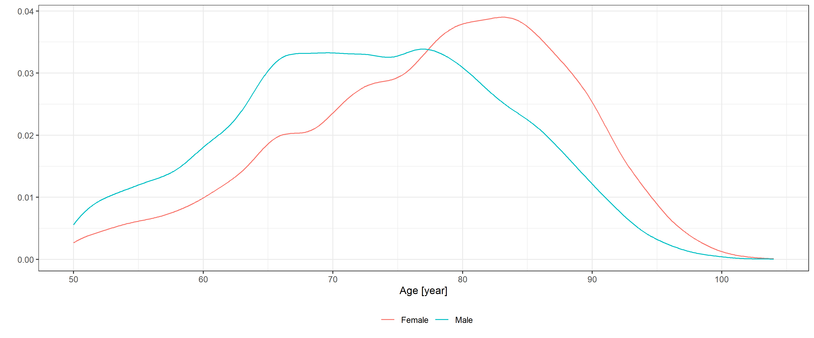

Different approaches to quantify years of life lost from COVID-19
================
Tamás Ferenci

## Manuscript:

Preprint is available at
<https://www.medrxiv.org/content/10.1101/2021.05.13.21257193v1>.

## Analysis

We first do some preparation:

``` r
library(ggplot2)
theme_set(theme_bw())
library(data.table)

name_cols <- c("atr_fib", "cancer", "copd", "demen", "diab", "h_fail", "hypert", "ihd", "renal", "liver",
               "stroke")
name_cols_age <- c("atr_fib:age", "cancer:age", "copd:age", "demen:age", "diab:age", "h_fail:age", 
                   "hypert:age", "ihd:age", "renal:age", "liver:age", "stroke:age")

StartDate <- as.Date("2020-03-04")
EndDate <- Sys.Date()
Pop50plus <- 3828819
```

We download the life table:

``` r
if(!file.exists("LifeTableHUN.rds")) {
  LifeTableMale <- HMDHFDplus::readHMDweb("HUN", "mltper_1x1")
  LifeTableFemale <- HMDHFDplus::readHMDweb("HUN", "fltper_1x1")
  LifeTable <- rbind(cbind(Sex = "Male", LifeTableMale), cbind(Sex = "Female", LifeTableFemale))
  LifeTable <- data.table(LifeTable[LifeTable$Year==2017, ])
  saveRDS(LifeTable, "LifeTableHUN.rds")
} else LifeTable <- readRDS("LifeTableHUN.rds")
```

We then scrape the mortality data:

``` r
pg <- xml2::read_html("https://koronavirus.gov.hu/elhunytak")
lastpg <- strsplit(rvest::html_attr(rvest::html_node(pg, xpath = "//li[@class='pager-last']/a"), "href"),
                   "=")[[1]][2]
MortData <- rbindlist(lapply(0:lastpg, function(i)
  rvest::html_table(xml2::read_html(paste0("https://koronavirus.gov.hu/elhunytak?page=", i)))[[1]]))
names(MortData) <- c("ID", "Sex", "Age", "Comorbidities")
unique(MortData$Sex)
```

    ## [1] "férfi" "no"    "Férfi" "No"    "Nő"

``` r
MortData$Sex <- as.factor(ifelse(MortData$Sex%in%c("férfi", "Férfi"), "Male", "Female"))
saveRDS(MortData, "MortData.rds")
```

Basic data:

``` r
nrow(MortData)
```

    ## [1] 29041

``` r
MortData <- MortData[Age>=50]
table(MortData$Sex)
```

    ## 
    ## Female   Male 
    ##  13707  14197

``` r
nrow(MortData)
```

    ## [1] 27904

We create the first plot and save it:

``` r
ggplot(MortData, aes(x = Age, color = Sex)) + stat_density(geom = "line", position = "identity") +
  labs(x = "Age [year]", y = "") +
  theme(legend.position = "bottom", legend.title = element_blank())
```

<!-- -->

``` r
ggsave("Fig1.eps", width = 84, height = 84, units = "mm", device = cairo_ps)
```

We can now merge the life table and the mortality data:

``` r
MortData <- merge(MortData, LifeTable)
MortData$Sex <- as.factor(MortData$Sex)
```

YLL using the ordinary calculation:

``` r
sum(MortData$ex) # YLL
```

    ## [1] 294250

``` r
tapply(MortData$ex, MortData$Sex, sum)
```

    ## Female   Male 
    ## 141741 152509

``` r
sum(MortData$ex) / nrow(MortData) # YLL per death
```

    ## [1] 10.5

``` r
tapply(MortData$ex, MortData$Sex, mean)
```

    ## Female   Male 
    ##   10.3   10.7

``` r
sum(MortData$ex) / (as.numeric(difftime(EndDate, StartDate, units = "days"))/365.24 * Pop50plus) # YLL per person-year
```

    ## [1] 0.0644

We then extract the comorbidities:

``` r
sort(unique(do.call(c, sapply(MortData$Comorbidities, strsplit, split = ""))))
```

    ## Warning in do.call(c, sapply(MortData$Comorbidities, strsplit, split = "")):
    ## unable to translate 'demencia, Parkinson<U+0096>kór, magasvérnyomás-
    ## betegség, szívelégtelenség' to native encoding

    ## Warning in do.call(c, sapply(MortData$Comorbidities, strsplit, split = "")):
    ## unable to translate 'nyelocso <U+0096> diverticulum, köszvény' to native
    ## encoding

    ##  [1] "-"      " "      " "      "\t"      "\n"     "\r"     "("      ")"     
    ##  [9] ","      "."      "/"      ":"      ";"      "?"      "”"      "„"     
    ## [17] "<U+0096>" "0"      "1"      "2"      "3"      "5"      "9"      "a"     
    ## [25] "A"      "á"      "Á"      "b"      "B"      "c"      "C"      "d"     
    ## [33] "D"      "e"      "E"      "é"      "É"      "f"      "F"      "g"     
    ## [41] "G"      "h"      "H"      "i"      "I"      "í"      "j"      "J"     
    ## [49] "k"      "K"      "l"      "L"      "m"      "M"      "n"      "N"     
    ## [57] "o"      "o"      "O"      "ó"      "ö"      "ő"      "p"      "P"     
    ## [65] "r"      "R"      "s"      "S"      "t"      "T"      "u"      "u"     
    ## [73] "U"      "ú"      "ü"      "Ü"      "ű"      "v"      "V"      "w"     
    ## [81] "W"      "x"      "y"      "Y"      "z"      "Z"

``` r
MortData$Comorbidities[grep("\u0096", MortData$Comorbidities)] <- gsub("\u0096", "", MortData$Comorbidities[grep("\u0096", MortData$Comorbidities)])

MortData$Comorbidities <- stringi::stri_trans_general(MortData$Comorbidities, "Latin-ASCII")

sort(unique(do.call(c, sapply(MortData$Comorbidities, strsplit, split = ""))))
```

    ##  [1] "-"  " "  "\t"  "\n" "\r" "\"" "("  ")"  ","  "."  "/"  ":"  ";"  "?"  "0" 
    ## [16] "1"  "2"  "3"  "5"  "9"  "a"  "A"  "b"  "B"  "c"  "C"  "d"  "D"  "e"  "E" 
    ## [31] "f"  "F"  "g"  "G"  "h"  "H"  "i"  "I"  "j"  "J"  "k"  "K"  "l"  "L"  "m" 
    ## [46] "M"  "n"  "N"  "o"  "O"  "p"  "P"  "r"  "R"  "s"  "S"  "t"  "T"  "u"  "U" 
    ## [61] "v"  "V"  "w"  "W"  "x"  "y"  "Y"  "z"  "Z"

``` r
MortData$atr_fib <- grepl("fibril", MortData$Comorbidities, ignore.case = TRUE)
MortData$cancer <- grepl("rak|tumor|noma|daganat|metas[z]?t|attet", MortData$Comorbidities, ignore.case = TRUE)
MortData$copd <- grepl("obstru[c|k]tiv[[:blank:]]tudo|copd", MortData$Comorbidities, ignore.case = TRUE)
MortData$demen <- grepl("demen", MortData$Comorbidities, ignore.case = TRUE)
MortData$diab <- grepl("diabetes|cukorbeteg|mellitus", MortData$Comorbidities, ignore.case = TRUE)|grepl("DM|IDDM|T1DM|T2DM", MortData$Comorbidities, ignore.case = FALSE)
MortData$h_fail <- grepl("szivelegtelen", MortData$Comorbidities, ignore.case = TRUE)
MortData$hypert <- grepl("h[i|y]pertonia|magas[[:blank:]|-]?vernyomas", MortData$Comorbidities, ignore.case = TRUE)
MortData$ihd <- grepl("isch[a]?emias[[:blank:]]sziv|iszk[a]?emias[[:blank:]]sziv|angina|infar[k|c]tus", MortData$Comorbidities, ignore.case = TRUE)|grepl("IHD|CAD|CHD|AMI", MortData$Comorbidities, ignore.case = FALSE)
MortData$renal <- grepl("kronikus[[:blank:]]vese[[:blank:]|-]?elegtelen|chronicus[[:blank:]]vese[[:blank:]|-]?elegtelen", MortData$Comorbidities, ignore.case = TRUE)
MortData$liver <- grepl("kronikus[[:blank:]]maj|chronicus[[:blank:]]maj|majzsugor|majelegtelen|cirr|kronikus[[:blank:]]hepa|chronicus[[:blank:]]hepa|majmegna|alkoholos[[:blank:]]maj", MortData$Comorbidities, ignore.case = TRUE)
MortData$stroke <- grepl("stroke|sztrok|agyi[[:blank:]]erkat|agyverzes", MortData$Comorbidities, ignore.case = TRUE)

ComorbLabels <- data.table(variable = c("atr_fib", "cancer", "copd", "demen", "diab",
                                        "h_fail", "hypert", "ihd", "renal", "liver", "stroke"),
                           varlabel = c("Atrial fibrillation", "Cancer", "COPD", "Dementia", "Diabetes", "Heart failure",
                                        "Hypertension", "IHD", "Chronic renal failure", "Chronic liver disease", "Stroke"))
```

We calculate the first table and save it:

``` r
tab1 <- merge(melt(MortData,  measure.vars = ComorbLabels$variable), ComorbLabels)[
  ,.(mean(value)*100, binom.test(sum(value), length(value))$conf.int[1]*100,
     binom.test(sum(value), length(value))$conf.int[2]*100), .(varlabel)
][, .(varlabel, paste0(round(V1, 1), " (", round(V2, 1), "-", round(V3, 1), ")"))]
knitr::kable(tab1)
```

| varlabel              | V2               |
|:----------------------|:-----------------|
| Atrial fibrillation   | 3.4 (3.2-3.6)    |
| Cancer                | 10.9 (10.6-11.3) |
| COPD                  | 3.8 (3.6-4.1)    |
| Dementia              | 7.6 (7.3-7.9)    |
| Diabetes              | 30 (29.4-30.5)   |
| Heart failure         | 7.5 (7.2-7.8)    |
| Hypertension          | 67.9 (67.4-68.5) |
| IHD                   | 14.6 (14.2-15)   |
| Chronic liver disease | 0.8 (0.7-0.9)    |
| Chronic renal failure | 5.4 (5.1-5.7)    |
| Stroke                | 2.9 (2.7-3.1)    |

``` r
write.csv2(tab1, "Tab1.csv")
```

We then create the second figure and save it:

``` r
predgrid <- expand.grid(Age = seq(50, 100, 0.1), Sex = c("Male", "Female"))
ComorbPrevs <- rbindlist(setNames(lapply(ComorbLabels$variable, function(v) {
  fit <- mgcv::gam(as.formula(paste0(v, "~ s(Age, by = Sex) + Sex")), data = MortData, family = binomial)
  cbind(predgrid, with(predict(fit, predgrid, se.fit = TRUE),
                       data.frame(est = plogis(fit), lwr = plogis(fit - 1.96*se.fit),
                                  upr = plogis(fit + 1.96*se.fit))))
}), ComorbLabels$varlabel), idcol = TRUE)
ggplot(ComorbPrevs, aes(x = Age, y = est*100, color = Sex, fill = Sex, ymin = lwr*100, ymax = upr*100)) +
  geom_line() + geom_ribbon(alpha = 0.2, linetype = 0) + facet_wrap(~.id) +
  labs(x = "Age [year]", y = "Prevalence [%]") +
  theme(legend.position = "bottom", legend.title = element_blank())
```

<!-- -->

``` r
ggsave("Fig2.eps", width = 174, height = 174, units = "mm", device = cairo_ps)
```

And then the third one:

``` r
MortData$ComorbCount <- rowSums(MortData[, ..name_cols])
prop.table(table(MortData$ComorbCount))*100
```

    ## 
    ##        0        1        2        3        4        5        6        7 
    ## 14.13059 36.36396 33.71918 12.65052  2.64478  0.42288  0.06451  0.00358

``` r
mean(MortData$ComorbCount>2)*100
```

    ## [1] 15.8

``` r
ggplot(reshape2::melt(table(MortData$ComorbCount, MortData$Age, MortData$Sex)),
       aes(x = Var2, fill = forcats::fct_rev(as.factor(Var1)), y = value)) + geom_area(position = "fill", alpha = 0.7) +
  facet_grid(cols = vars(Var3)) + scale_x_continuous(expand = c(0, 0), limits = c(50, 90)) +
  scale_y_continuous(labels = scales::percent_format(suffix = ""), expand = c(0, 0)) + 
  labs(x = "Age [year]", y = "Proportion [%]", fill = "Number of comorbidities") +
  guides(fill = guide_legend(reverse = TRUE)) +
  theme(legend.position = "bottom", legend.title = element_blank(), panel.spacing = unit(1, "lines"))
```

    ## Warning: Removed 224 rows containing missing values (position_stack).

<!-- -->

``` r
ggsave("Fig3.eps", width = 174, height = 174, units = "mm", device = cairo_ps)
```

    ## Warning: Removed 224 rows containing missing values (position_stack).

Next, we integrate the external survival model and run a few checks:

``` r
male_coef <- read.csv("https://raw.githubusercontent.com/dmcalli2/covid19_yll_final/master/Data/sail_outputs/male_coef.csv")
male_coef <- setNames(male_coef$x, male_coef$X)
female_coef <- read.csv("https://raw.githubusercontent.com/dmcalli2/covid19_yll_final/master/Data/sail_outputs/female_coef.csv")
female_coef <- setNames(female_coef$x, female_coef$X)

SurvGomp <- function(t, start, ...) {
  ret <- (1 - flexsurv:::pgompertz_work(t, ...))/(1-flexsurv:::pgompertz_work(start, ...))
  ret[t<start] <- 1
  ret
}

times_vect <- seq(50, 150, 0.1)

temp <- 1-SurvGomp(t = times_vect, start = MortData$Age[2], shape = male_coef["shape"],
                   rate = exp(male_coef["rate"] + as.matrix(MortData[2, ..name_cols])%*%male_coef[name_cols] +
                                (MortData$Age[2]*as.matrix(MortData[2, ..name_cols]))%*%male_coef[name_cols_age]),
                   lower_tail = TRUE, give_log = FALSE)

temp <- 1-SurvGomp(t = times_vect, start = 60, shape = female_coef["shape"],
                   rate = exp(female_coef["rate"]),
                   lower_tail = TRUE, give_log = FALSE)

sum(temp - c(0, temp[-length(temp)]))
```

    ## [1] 1

``` r
sum((temp - c(0, temp[-length(temp)]))*times_vect)
```

    ## [1] 88

``` r
sum((temp - c(0, temp[-length(temp)]))*times_vect)-MortData$Age[2]
```

    ## [1] 38

``` r
offsetgrid <- data.table(expand.grid(Sex = c("Male", "Female"), Age = 50:110))
offsetgrid$AdjustedEx <- sapply(1:nrow(offsetgrid), function(i) {
  usedcoefs <- if(offsetgrid$Sex[i]=="Male") male_coef else female_coef
  temp <- 1-SurvGomp(t = times_vect, start = offsetgrid$Age[i], shape = usedcoefs["shape"],
                     rate = exp(usedcoefs["rate"]), lower_tail = TRUE, give_log = FALSE)
  sum((temp - c(0, temp[-length(temp)]))*times_vect)-offsetgrid$Age[i]
})
offsetgrid <- merge(offsetgrid, LifeTable)
ggplot(offsetgrid, aes(x = ex, y = AdjustedEx)) + geom_point() + facet_grid(cols = vars(Sex)) +
  geom_abline(intercept = 0, slope = 1)
```

<!-- -->

``` r
offsetgrid$ratio <- offsetgrid$ex/offsetgrid$AdjustedEx
offsetgrid$leratio <- (offsetgrid$Age + offsetgrid$ex)/(offsetgrid$Age + offsetgrid$AdjustedEx)

MortData$AdjustedEx <- sapply(1:nrow(MortData), function(i) {
  usedcoefs <- if(MortData$Sex[i]=="Male") male_coef else female_coef
  temp <- 1-SurvGomp(t = times_vect, start = MortData$Age[i], shape = usedcoefs["shape"],
                     rate = exp(usedcoefs["rate"] + as.matrix(MortData[i, ..name_cols])%*%usedcoefs[name_cols] +
                                  (MortData$Age[i]*as.matrix(MortData[i, ..name_cols]))%*%usedcoefs[name_cols_age]),
                     lower_tail = TRUE, give_log = FALSE)
  # sum((temp - c(0, temp[-length(temp)]))*times_vect)*offsetgrid[Sex==MortData$Sex[i]&Age==MortData$Age[i]]$leratio-MortData$Age[i]
  (sum((temp - c(0, temp[-length(temp)]))*times_vect)-MortData$Age[i])*offsetgrid[Sex==MortData$Sex[i]&Age==MortData$Age[i]]$ratio
})
```

We can now create the fourth figure:

``` r
ggplot(MortData, aes(x = ex, y = AdjustedEx, color = Age)) + geom_jitter(size = 0.1, width = 1, height = 1) +
  facet_grid(cols = vars(Sex)) + geom_abline(intercept = 0, slope = 1, color = "red") +
  labs(x = "Expected number of years of life remaining, Hungarian life table [year]",
       y = "Expected number of years of life remaining, Hanlon et al survival model [year]")
```

<!-- -->

``` r
ggsave("Fig4.eps", width = 174, height = 174, units = "mm", device = cairo_ps)
```

And calculate the adjusted YLLs:

``` r
sum(MortData$AdjustedEx) # YLL
```

    ## [1] 256701

``` r
sum(MortData$AdjustedEx) / nrow(MortData) # YLL per death
```

    ## [1] 9.2

``` r
tapply(MortData$AdjustedEx, MortData$Sex, mean)
```

    ## Female   Male 
    ##   8.98   9.41

``` r
sum(MortData$AdjustedEx) / (as.numeric(difftime(EndDate, StartDate, units = "days"))/365.24 * Pop50plus) # YLL per person-year
```

    ## [1] 0.0562

``` r
100-sum(MortData$AdjustedEx)/sum(MortData$ex)*100
```

    ## [1] 12.8

Life-table norms:

``` r
sum(LifeTable[Sex=="Female", .(dx*ex)]$V1)/sum(LifeTable[Sex=="Female"]$dx)
```

    ## [1] 10.3

``` r
sum(LifeTable[Sex=="Male", .(dx*ex)]$V1)/sum(LifeTable[Sex=="Male"]$dx)
```

    ## [1] 11.9

``` r
sum(LifeTable[, .(dx*ex)]$V1)/sum(LifeTable$dx)
```

    ## [1] 11.1
